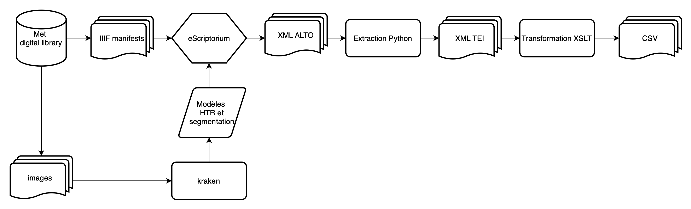

# Pictorialist Photography Exhibition Catalogs, 1891-1914
___

## Project

This project aims to encode and study Pictorialist Photography Exhibition Catalogs from the Metropolitan Museum of Art Library (Joyce F. Menschel Photography Library), available [here](https://www.metmuseum.org/art/libraries-and-research-centers/watson-digital-collections/rare-materials-in-the-met-libraries/pictorialist-photography-exhibition-catalogs-1891-1914). 

This repository is under construction. For the moment, it only contains catalogs of the Photo-Club de Paris exhibitions. 

## Workflow 

  

## Repository

`CSV`: CSV files containing exhibition catalogue entries  
`TEI`: XML TEI files containing exhibition catalogue entries  
`extended_tsv`: TSV files containing exhibition catalogue entries, cleaned and enriched with OpenRefine

## Licence
XML-TEI files, CSV files and TSV files are made available under a [CC-BY](https://creativecommons.org/licenses/by/2.0/fr/) licence.

The materials that were used to create these files are in the public domain and are made available by the Metropolitan Museum of Art under a [CC0](https://creativecommons.org/publicdomain/zero/1.0/deed.fr) licence.

## Cite this repository

## Contacts

frederine.pradier@etu-unige.ch
# PictoCatalogs.github.io
# Corpus
